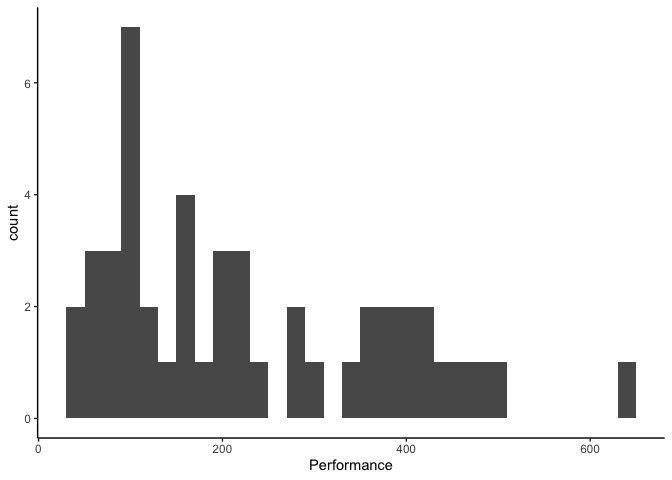
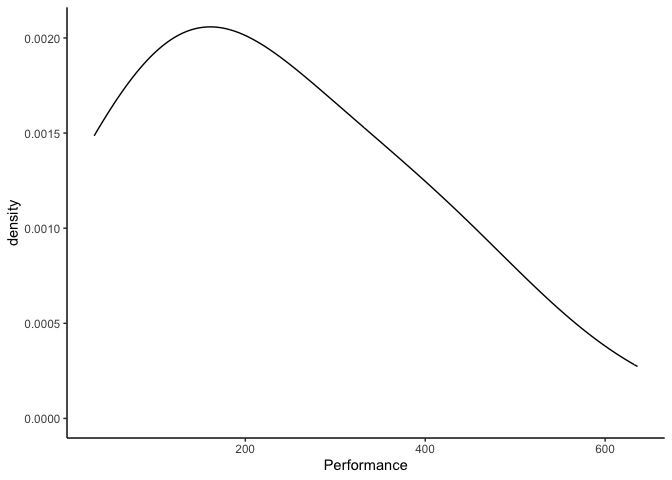
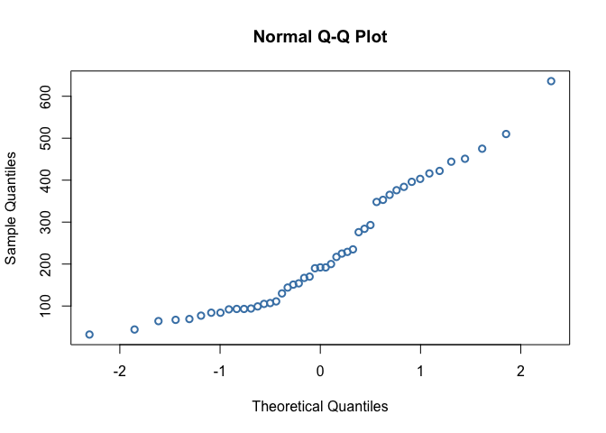
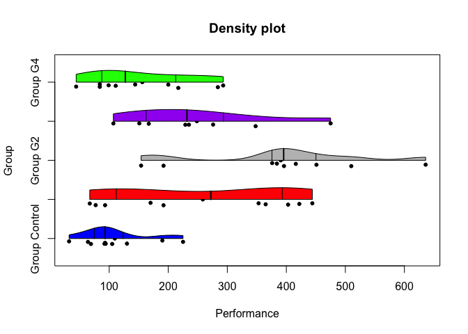
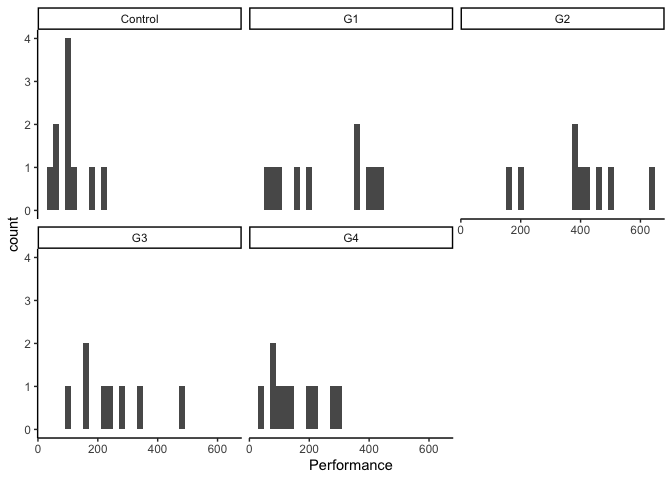
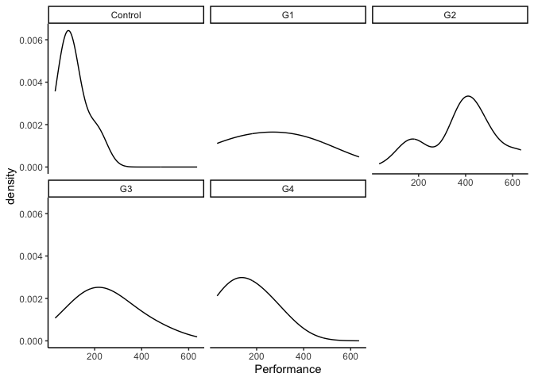
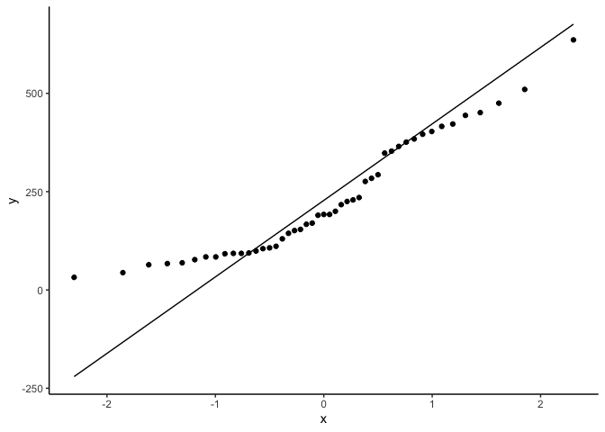
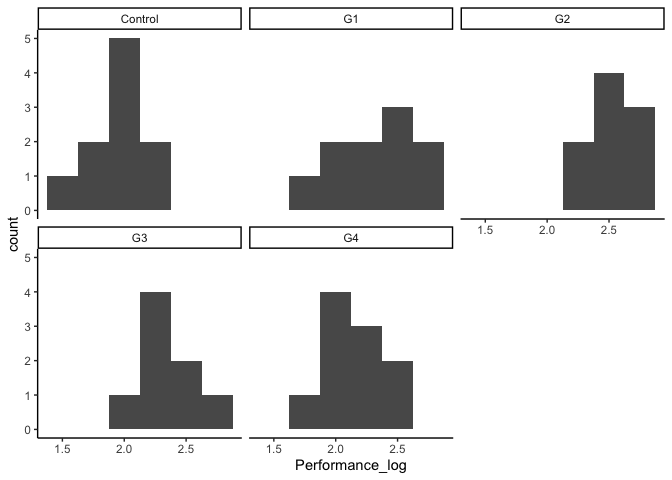
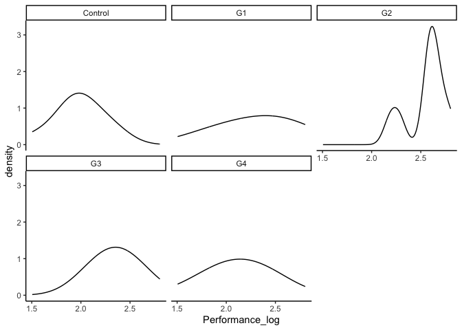
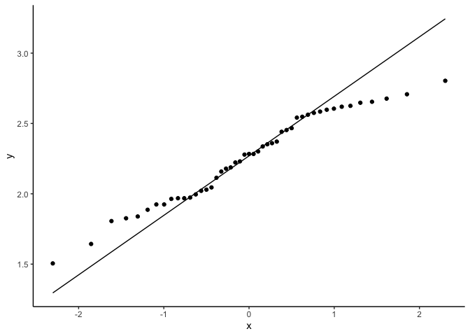

Lab4
================
Toko Michioka
2024-09-26

``` r
library(car)
```

    ## Loading required package: carData

``` r
library(dplyr)
```

    ## 
    ## Attaching package: 'dplyr'

    ## The following object is masked from 'package:car':
    ## 
    ##     recode

    ## The following objects are masked from 'package:stats':
    ## 
    ##     filter, lag

    ## The following objects are masked from 'package:base':
    ## 
    ##     intersect, setdiff, setequal, union

``` r
library(tidyr)
library(ggplot2)
library(psych)
```

    ## 
    ## Attaching package: 'psych'

    ## The following objects are masked from 'package:ggplot2':
    ## 
    ##     %+%, alpha

    ## The following object is masked from 'package:car':
    ## 
    ##     logit

``` r
library(bruceR)
```

    ## 
    ## bruceR (v2024.6)
    ## Broadly Useful Convenient and Efficient R functions
    ## 
    ## Packages also loaded:
    ## ✔ data.table ✔ emmeans
    ## ✔ dplyr      ✔ lmerTest
    ## ✔ tidyr      ✔ effectsize
    ## ✔ stringr    ✔ performance
    ## ✔ ggplot2    ✔ interactions
    ## 
    ## Main functions of `bruceR`:
    ## cc()             Describe()  TTEST()
    ## add()            Freq()      MANOVA()
    ## .mean()          Corr()      EMMEANS()
    ## set.wd()         Alpha()     PROCESS()
    ## import()         EFA()       model_summary()
    ## print_table()    CFA()       lavaan_summary()
    ## 
    ## For full functionality, please install all dependencies:
    ## install.packages("bruceR", dep=TRUE)
    ## 
    ## Online documentation:
    ## https://psychbruce.github.io/bruceR
    ## 
    ## To use this package in publications, please cite:
    ## Bao, H.-W.-S. (2024). bruceR: Broadly useful convenient and efficient R functions (Version 2024.6) [Computer software]. https://CRAN.R-project.org/package=bruceR

    ## 
    ## These packages are dependencies of `bruceR` but not installed:
    ## - pacman, openxlsx, ggtext, lmtest, vars, phia, MuMIn, GGally
    ## 
    ## ***** Install all dependencies *****
    ## install.packages("bruceR", dep=TRUE)

# Load dataset

``` r
lab4data <- read.csv("/Users/toko/Documents/GitHub/Lab4/skewed.csv")
```

# Normality

## Normality Plots

``` r
ggplot(lab4data, aes(x = Performance)) + geom_histogram(binwidth = 20) + theme_classic()
```

    ## Warning: Removed 3 rows containing non-finite outside the scale range
    ## (`stat_bin()`).

<!-- -->

``` r
ggplot(lab4data, aes(x = Performance)) + geom_density(adjust = 2)  + theme_classic()
```

    ## Warning: Removed 3 rows containing non-finite outside the scale range
    ## (`stat_density()`).

<!-- -->

``` r
qq<-ggplot(lab4data, aes(sample = Performance)) + geom_qq()  + theme_classic()

qq+ geom_qq_line()
```

    ## Warning: Removed 3 rows containing non-finite outside the scale range
    ## (`stat_qq()`).

    ## Warning: Removed 3 rows containing non-finite outside the scale range
    ## (`stat_qq_line()`).

<!-- -->

``` r
#functions below are base R functions, they can do the job, but not as customizable as ggplot

hist(lab4data$Performance)
```

<!-- -->

``` r
qqnorm(lab4data$Performance, col = "steelblue", lwd = 2)
```

<!-- -->

``` r
plot(density(lab4data$Performance, na.rm = TRUE, bw = 90),  lwd=2, main = "")
```

<!-- -->

### Normality Plots by Group

``` r
#a fun function to plot the violin plot by group, but it's not part of ggplot
violinBy(Performance ~ Group, data = lab4data, rain= TRUE, vertical = FALSE)
```

<!-- -->

``` r
#Find a way to plot the histograms, density, and qq plots by groups using ggplot
ggplot(lab4data, aes(x = Performance)) + geom_histogram(binwidth = 20) + facet_wrap (~Group) + theme_classic()
```

    ## Warning: Removed 3 rows containing non-finite outside the scale range
    ## (`stat_bin()`).

<!-- -->

``` r
ggplot(lab4data, aes(x = Performance)) + geom_density(adjust = 2)  + facet_wrap (~Group) + theme_classic()
```

    ## Warning: Removed 3 rows containing non-finite outside the scale range
    ## (`stat_density()`).

<!-- -->

``` r
qq<-ggplot(lab4data, aes(sample = Performance)) + geom_qq()  + theme_classic()

qq+ geom_qq_line()
```

    ## Warning: Removed 3 rows containing non-finite outside the scale range
    ## (`stat_qq()`).

    ## Warning: Removed 3 rows containing non-finite outside the scale range
    ## (`stat_qq_line()`).

<!-- -->

``` r
#Use ggplot to create a violin plot by groups
```

## Normality Tests

``` r
describe(lab4data$Performance)
```

    ##    vars  n   mean     sd median trimmed    mad min max range skew kurtosis   se
    ## X1    1 47 228.57 149.47    192  217.03 148.26  32 636   604 0.68    -0.57 21.8

``` r
shapiro.test(lab4data$Performance)
```

    ## 
    ##  Shapiro-Wilk normality test
    ## 
    ## data:  lab4data$Performance
    ## W = 0.91565, p-value = 0.002365

### Normality Tests by Group

``` r
#Use the describeBy() function to get skewness and kurtosis by group

?describeBy() 
describeBy(Performance ~ Group, data = lab4data)
```

    ## 
    ##  Descriptive statistics by group 
    ## Group: Control
    ##             vars  n  mean   sd median trimmed   mad min max range skew kurtosis
    ## Performance    1 10 109.4 58.5   93.5  104.62 40.03  32 225   193 0.72    -0.75
    ##               se
    ## Performance 18.5
    ## ------------------------------------------------------------ 
    ## Group: G1
    ##             vars  n  mean     sd median trimmed    mad min max range  skew
    ## Performance    1 10 258.6 153.32  272.5  259.38 207.56  67 444   377 -0.08
    ##             kurtosis    se
    ## Performance    -1.95 48.48
    ## ------------------------------------------------------------ 
    ## Group: G2
    ##             vars n   mean     sd median trimmed   mad min max range  skew
    ## Performance    1 9 390.56 147.68    396  390.56 81.54 154 636   482 -0.15
    ##             kurtosis    se
    ## Performance    -1.01 49.23
    ## ------------------------------------------------------------ 
    ## Group: G3
    ##             vars n  mean     sd median trimmed    mad min max range skew
    ## Performance    1 8 248.5 118.74    232   248.5 108.23 107 475   368 0.62
    ##             kurtosis    se
    ## Performance    -0.95 41.98
    ## ------------------------------------------------------------ 
    ## Group: G4
    ##             vars  n mean    sd median trimmed   mad min max range skew kurtosis
    ## Performance    1 10  156 87.65  127.5  152.88 85.99  44 293   249 0.38    -1.54
    ##                se
    ## Performance 27.72

``` r
#Use the group by function to get shapiro test results by group
lab4data %>%
  group_by(Group) %>%
  summarize(W = shapiro.test(Performance)$statistic, p_value = shapiro.test(Performance)$p.value)
```

    ## # A tibble: 5 × 3
    ##   Group       W p_value
    ##   <chr>   <dbl>   <dbl>
    ## 1 Control 0.904  0.245 
    ## 2 G1      0.860  0.0771
    ## 3 G2      0.939  0.571 
    ## 4 G3      0.939  0.600 
    ## 5 G4      0.910  0.283

``` r
#Use the filter function to get both
```

# Q1: What is your overall conclusion about this variable’s normality? Why?

This variable’s normality is met since all of the p-values are over the
threshold = .05, meaning it’s insignificant.

# Equal Variance between Groups

## Descrptive Variance

``` r
lab4data_clean<-drop_na(lab4data)
var(lab4data$Performance)
```

    ## [1] NA

``` r
lab4data_clean %>%
  group_by(Group) %>%
  summarize(variance = var(Performance))
```

    ## # A tibble: 5 × 2
    ##   Group   variance
    ##   <chr>      <dbl>
    ## 1 Control    3422.
    ## 2 G1        23506.
    ## 3 G2        21810.
    ## 4 G3        14099.
    ## 5 G4         7682.

## Equal Variance Test

``` r
leveneTest(Performance~Group, lab4data)
```

    ## Warning in leveneTest.default(y = y, group = group, ...): group coerced to
    ## factor.

    ## Levene's Test for Homogeneity of Variance (center = median)
    ##       Df F value Pr(>F)  
    ## group  4  2.9461 0.0311 *
    ##       42                 
    ## ---
    ## Signif. codes:  0 '***' 0.001 '**' 0.01 '*' 0.05 '.' 0.1 ' ' 1

``` r
MANOVA(lab4data, dv = "Performance", between = "Group")
```

    ## Warning: Missing values for 3 ID(s), which were removed before analysis:
    ## 30, 39, 40
    ## Below the first few rows (in wide format) of the removed cases with missing data.
    ##      bruceR.ID Group  .
    ## # 30        30    G2 NA
    ## # 39        39    G3 NA
    ## # 40        40    G3 NA

    ## 
    ## ====== ANOVA (Between-Subjects Design) ======
    ## 
    ## Descriptives:
    ## ─────────────────────────────
    ##  "Group"    Mean      S.D.  n
    ## ─────────────────────────────
    ##  Control 109.400 ( 58.496) 10
    ##  G1      258.600 (153.317) 10
    ##  G2      390.556 (147.681)  9
    ##  G3      248.500 (118.739)  8
    ##  G4      156.000 ( 87.648) 10
    ## ─────────────────────────────
    ## Total sample size: N = 50
    ## 
    ## ANOVA Table:
    ## Dependent variable(s):      Performance
    ## Between-subjects factor(s): Group
    ## Within-subjects factor(s):  –
    ## Covariate(s):               –
    ## ────────────────────────────────────────────────────────────────────────────
    ##                MS       MSE df1 df2     F     p     η²p [90% CI of η²p]  η²G
    ## ────────────────────────────────────────────────────────────────────────────
    ## Group  110757.117 13920.501   4  42 7.956 <.001 ***   .431 [.208, .560] .431
    ## ────────────────────────────────────────────────────────────────────────────
    ## MSE = mean square error (the residual variance of the linear model)
    ## η²p = partial eta-squared = SS / (SS + SSE) = F * df1 / (F * df1 + df2)
    ## ω²p = partial omega-squared = (F - 1) * df1 / (F * df1 + df2 + 1)
    ## η²G = generalized eta-squared (see Olejnik & Algina, 2003)
    ## Cohen’s f² = η²p / (1 - η²p)
    ## 
    ## Levene’s Test for Homogeneity of Variance:
    ## ─────────────────────────────────────────────
    ##                  Levene’s F df1 df2     p    
    ## ─────────────────────────────────────────────
    ## DV: Performance       3.165   4  42  .023 *  
    ## ─────────────────────────────────────────────

``` r
#What if you want to test equal variance between 2 groups specifically? 
```

# Q2: Overall, does it meet the equal variance assumption across the groups? Why?

No, because the p-value (.023) is under the threshold (.05), meaning it
is insignificant. Therefore, it does not meet the equal variance
assumption across the groups.

# Transformation

``` r
#if any of the assumption is not met, use transformation 

lab4data$Performance_log <- log10(lab4data$Performance)
```

``` r
ggplot(lab4data, aes(x = Performance_log)) + geom_histogram(binwidth = 0.25) + facet_wrap (~Group) + theme_classic()
```

    ## Warning: Removed 3 rows containing non-finite outside the scale range
    ## (`stat_bin()`).

<!-- -->

``` r
ggplot(lab4data, aes(x = Performance_log)) + geom_density(adjust = 2)  + facet_wrap (~Group) + theme_classic()
```

    ## Warning: Removed 3 rows containing non-finite outside the scale range
    ## (`stat_density()`).

<!-- -->

``` r
qq<-ggplot(lab4data, aes(sample = Performance_log)) + geom_qq()  + theme_classic()

qq+ geom_qq_line()
```

    ## Warning: Removed 3 rows containing non-finite outside the scale range
    ## (`stat_qq()`).

    ## Warning: Removed 3 rows containing non-finite outside the scale range
    ## (`stat_qq_line()`).

<!-- -->

``` r
describe(lab4data$Performance_log)
```

    ##    vars  n mean   sd median trimmed  mad  min max range  skew kurtosis   se
    ## X1    1 47 2.26 0.32   2.28    2.27 0.43 1.51 2.8   1.3 -0.26    -0.91 0.05

``` r
shapiro.test(lab4data$Performance_log)
```

    ## 
    ##  Shapiro-Wilk normality test
    ## 
    ## data:  lab4data$Performance_log
    ## W = 0.96379, p-value = 0.152

``` r
describeBy(Performance_log ~ Group, data = lab4data)
```

    ## 
    ##  Descriptive statistics by group 
    ## Group: Control
    ##                 vars  n mean   sd median trimmed mad  min  max range  skew
    ## Performance_log    1 10 1.98 0.24   1.97       2 0.2 1.51 2.35  0.85 -0.27
    ##                 kurtosis   se
    ## Performance_log    -0.64 0.08
    ## ------------------------------------------------------------ 
    ## Group: G1
    ##                 vars  n mean   sd median trimmed mad  min  max range  skew
    ## Performance_log    1 10 2.32 0.33   2.42    2.34 0.3 1.83 2.65  0.82 -0.37
    ##                 kurtosis  se
    ## Performance_log    -1.74 0.1
    ## ------------------------------------------------------------ 
    ## Group: G2
    ##                 vars n mean  sd median trimmed  mad  min max range  skew
    ## Performance_log    1 9 2.56 0.2    2.6    2.56 0.08 2.19 2.8  0.62 -0.74
    ##                 kurtosis   se
    ## Performance_log     -0.9 0.07
    ## ------------------------------------------------------------ 
    ## Group: G3
    ##                 vars n mean   sd median trimmed  mad  min  max range skew
    ## Performance_log    1 8 2.35 0.21   2.37    2.35 0.24 2.03 2.68  0.65    0
    ##                 kurtosis   se
    ## Performance_log    -1.34 0.07
    ## ------------------------------------------------------------ 
    ## Group: G4
    ##                 vars  n mean   sd median trimmed  mad  min  max range  skew
    ## Performance_log    1 10 2.12 0.27    2.1    2.14 0.28 1.64 2.47  0.82 -0.21
    ##                 kurtosis   se
    ## Performance_log    -1.29 0.08

``` r
lab4data %>%
  group_by(Group) %>%
  summarize(W = shapiro.test(Performance_log)$statistic, p_value = shapiro.test(Performance_log)$p.value)
```

    ## # A tibble: 5 × 3
    ##   Group       W p_value
    ##   <chr>   <dbl>   <dbl>
    ## 1 Control 0.957  0.747 
    ## 2 G1      0.850  0.0584
    ## 3 G2      0.867  0.114 
    ## 4 G3      0.989  0.994 
    ## 5 G4      0.947  0.637

``` r
lab4data_clean<-drop_na(lab4data)
var(lab4data$Performance_log)
```

    ## [1] NA

``` r
lab4data_clean %>%
  group_by(Group) %>%
  summarize(variance = var(Performance_log))
```

    ## # A tibble: 5 × 2
    ##   Group   variance
    ##   <chr>      <dbl>
    ## 1 Control   0.0582
    ## 2 G1        0.106 
    ## 3 G2        0.0389
    ## 4 G3        0.0429
    ## 5 G4        0.0708

``` r
leveneTest(Performance_log~Group, lab4data)
```

    ## Warning in leveneTest.default(y = y, group = group, ...): group coerced to
    ## factor.

    ## Levene's Test for Homogeneity of Variance (center = median)
    ##       Df F value Pr(>F)
    ## group  4   1.483 0.2245
    ##       42

``` r
MANOVA(lab4data, dv = "Performance_log", between = "Group")
```

    ## Warning: Missing values for 3 ID(s), which were removed before analysis:
    ## 30, 39, 40
    ## Below the first few rows (in wide format) of the removed cases with missing data.
    ##      bruceR.ID Group  .
    ## # 30        30    G2 NA
    ## # 39        39    G3 NA
    ## # 40        40    G3 NA

    ## 
    ## ====== ANOVA (Between-Subjects Design) ======
    ## 
    ## Descriptives:
    ## ─────────────────────────
    ##  "Group"  Mean    S.D.  n
    ## ─────────────────────────
    ##  Control 1.982 (0.241) 10
    ##  G1      2.318 (0.326) 10
    ##  G2      2.557 (0.197)  9
    ##  G3      2.353 (0.207)  8
    ##  G4      2.125 (0.266) 10
    ## ─────────────────────────
    ## Total sample size: N = 50
    ## 
    ## ANOVA Table:
    ## Dependent variable(s):      Performance_log
    ## Between-subjects factor(s): Group
    ## Within-subjects factor(s):  –
    ## Covariate(s):               –
    ## ───────────────────────────────────────────────────────────────────
    ##           MS   MSE df1 df2     F     p     η²p [90% CI of η²p]  η²G
    ## ───────────────────────────────────────────────────────────────────
    ## Group  0.463 0.065   4  42 7.119 <.001 ***   .404 [.178, .537] .404
    ## ───────────────────────────────────────────────────────────────────
    ## MSE = mean square error (the residual variance of the linear model)
    ## η²p = partial eta-squared = SS / (SS + SSE) = F * df1 / (F * df1 + df2)
    ## ω²p = partial omega-squared = (F - 1) * df1 / (F * df1 + df2 + 1)
    ## η²G = generalized eta-squared (see Olejnik & Algina, 2003)
    ## Cohen’s f² = η²p / (1 - η²p)
    ## 
    ## Levene’s Test for Homogeneity of Variance:
    ## ─────────────────────────────────────────────────
    ##                      Levene’s F df1 df2     p    
    ## ─────────────────────────────────────────────────
    ## DV: Performance_log       1.556   4  42  .204    
    ## ─────────────────────────────────────────────────

``` r
lab4dataConG1<-lab4data %>%
  filter(Group == "Control" | Group == "G1")

leveneTest(Performance_log~Group, lab4dataConG1)
```

    ## Warning in leveneTest.default(y = y, group = group, ...): group coerced to
    ## factor.

    ## Levene's Test for Homogeneity of Variance (center = median)
    ##       Df F value Pr(>F)
    ## group  1  2.2281 0.1528
    ##       18

# Q3: Run the above tests again with the transformed outcome. Compare the differences in results.

Before we made the transformation, the assumption of normality was
violated. After we transformed the data logarithmically and corrected
bandwidth, the data appeared normal.
