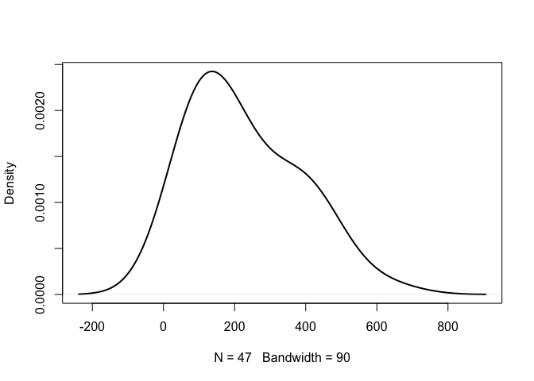

Lab4
================
Your Name
2024-09-26

``` r
library(car)
```

    ## Loading required package: carData

``` r
library(dplyr)
```

    ## 
    ## Attaching package: 'dplyr'

    ## The following object is masked from 'package:car':
    ## 
    ##     recode

    ## The following objects are masked from 'package:stats':
    ## 
    ##     filter, lag

    ## The following objects are masked from 'package:base':
    ## 
    ##     intersect, setdiff, setequal, union

``` r
library(tidyr)
library(ggplot2)
library(psych)
```

    ## Warning: package 'psych' was built under R version 4.3.3

    ## 
    ## Attaching package: 'psych'

    ## The following objects are masked from 'package:ggplot2':
    ## 
    ##     %+%, alpha

    ## The following object is masked from 'package:car':
    ## 
    ##     logit

``` r
library(bruceR)
```

    ## 
    ## bruceR (v2023.9)
    ## Broadly Useful Convenient and Efficient R functions
    ## 
    ## Packages also loaded:
    ## ✔ data.table ✔ emmeans
    ## ✔ dplyr      ✔ lmerTest
    ## ✔ tidyr      ✔ effectsize
    ## ✔ stringr    ✔ performance
    ## ✔ ggplot2    ✔ interactions
    ## 
    ## Main functions of `bruceR`:
    ## cc()             Describe()  TTEST()
    ## add()            Freq()      MANOVA()
    ## .mean()          Corr()      EMMEANS()
    ## set.wd()         Alpha()     PROCESS()
    ## import()         EFA()       model_summary()
    ## print_table()    CFA()       lavaan_summary()
    ## 
    ## For full functionality, please install all dependencies:
    ## install.packages("bruceR", dep=TRUE)
    ## 
    ## Online documentation:
    ## https://psychbruce.github.io/bruceR
    ## 
    ## To use this package in publications, please cite:
    ## Bao, H.-W.-S. (2023). bruceR: Broadly useful convenient and efficient R functions (Version 2023.9) [Computer software]. https://CRAN.R-project.org/package=bruceR

    ## 
    ## NEWS: A new version of bruceR (2024.6) is available (2024-06-13)!
    ## 
    ## ***** Please update *****
    ## install.packages("bruceR", dep=TRUE)

    ## 
    ## These packages are dependencies of `bruceR` but not installed:
    ## - pacman, lmtest, vars, phia
    ## 
    ## ***** Install all dependencies *****
    ## install.packages("bruceR", dep=TRUE)

# Load dataset

``` r
lab4data <- read.csv("C:/Users/Colin/Documents/GitHub/Website/Lab4/skewed.csv")
```

# Normality

## Normality Plots

``` r
ggplot(lab4data, aes(x = Performance)) + geom_histogram(binwidth = 20) + theme_classic()
```

    ## Warning: Removed 3 rows containing non-finite outside the scale range
    ## (`stat_bin()`).

<!-- -->

``` r
ggplot(lab4data, aes(x = Performance)) + geom_density(adjust = 2)  + theme_classic()
```

    ## Warning: Removed 3 rows containing non-finite outside the scale range
    ## (`stat_density()`).

<!-- -->

``` r
qq<-ggplot(lab4data, aes(sample = Performance)) + geom_qq()  + theme_classic()

qq+ geom_qq_line()
```

    ## Warning: Removed 3 rows containing non-finite outside the scale range
    ## (`stat_qq()`).

    ## Warning: Removed 3 rows containing non-finite outside the scale range
    ## (`stat_qq_line()`).

<!-- -->

``` r
#functions below are base R functions, they can do the job, but not as customizable as ggplot

hist(lab4data$Performance)
```

<!-- -->

``` r
qqnorm(lab4data$Performance, col = "steelblue", lwd = 2)
```

<!-- -->

``` r
plot(density(lab4data$Performance, na.rm = TRUE, bw = 90),  lwd=2, main = "")
```

<!-- -->

### Normality Plots by Group

``` r
#a fun function to plot the violin plot by group, but it's not part of ggplot
#violinBy(Performance ~ Group, data = lab4data, rain= TRUE, vertical = FALSE)


#Find a way to plot the histograms, density, and qq plots by groups using ggplot


#Use ggplot to create a violin plot by groups
```

## Normality Tests

``` r
describe(lab4data$Performance)
```

    ##    vars  n   mean     sd median trimmed    mad min max range skew kurtosis   se
    ## X1    1 47 228.57 149.47    192  217.03 148.26  32 636   604 0.68    -0.57 21.8

``` r
shapiro.test(lab4data$Performance)
```

    ## 
    ##  Shapiro-Wilk normality test
    ## 
    ## data:  lab4data$Performance
    ## W = 0.91565, p-value = 0.002365

### Normality Tests by Group

``` r
#Use the describeBy() function to get skewness and kurtosis by group


#Use the group by function to get shapiro test results by group
lab4data %>%
  group_by(Group) %>%
  summarize(W = shapiro.test(Performance)$statistic)
```

    ## # A tibble: 5 × 2
    ##   Group       W
    ##   <chr>   <dbl>
    ## 1 Control 0.904
    ## 2 G1      0.860
    ## 3 G2      0.939
    ## 4 G3      0.939
    ## 5 G4      0.910

``` r
#Use the filter function to get both
```

# Q1: What is your overall conclusion about this variable’s normality? Why?

# Equal Variance between Groups

## Descrptive Variance

``` r
var(lab4data$Performance)
```

    ## [1] NA

``` r
#lab4data %>%
  #group_by(Group) %>%
  #summarize(...)
```

## Equal Variance Test

``` r
leveneTest(Performance~Group, lab4data)
```

    ## Warning in leveneTest.default(y = y, group = group, ...): group coerced to
    ## factor.

    ## Levene's Test for Homogeneity of Variance (center = median)
    ##       Df F value Pr(>F)  
    ## group  4  2.9461 0.0311 *
    ##       42                 
    ## ---
    ## Signif. codes:  0 '***' 0.001 '**' 0.01 '*' 0.05 '.' 0.1 ' ' 1

``` r
MANOVA(lab4data, dv = "Performance", between = "Group")
```

    ## Warning: Missing values for 3 ID(s), which were removed before analysis:
    ## 30, 39, 40
    ## Below the first few rows (in wide format) of the removed cases with missing data.
    ##      bruceR.ID Group  .
    ## # 30        30    G2 NA
    ## # 39        39    G3 NA
    ## # 40        40    G3 NA

    ## 
    ## ====== ANOVA (Between-Subjects Design) ======
    ## 
    ## Descriptives:
    ## ─────────────────────────────
    ##  "Group"    Mean      S.D.  n
    ## ─────────────────────────────
    ##  Control 109.400 ( 58.496) 10
    ##  G1      258.600 (153.317) 10
    ##  G2      390.556 (147.681)  9
    ##  G3      248.500 (118.739)  8
    ##  G4      156.000 ( 87.648) 10
    ## ─────────────────────────────
    ## Total sample size: N = 50
    ## 
    ## ANOVA Table:
    ## Dependent variable(s):      Performance
    ## Between-subjects factor(s): Group
    ## Within-subjects factor(s):  –
    ## Covariate(s):               –
    ## ────────────────────────────────────────────────────────────────────────────
    ##                MS       MSE df1 df2     F     p     η²p [90% CI of η²p]  η²G
    ## ────────────────────────────────────────────────────────────────────────────
    ## Group  110757.117 13920.501   4  42 7.956 <.001 ***   .431 [.208, .560] .431
    ## ────────────────────────────────────────────────────────────────────────────
    ## MSE = mean square error (the residual variance of the linear model)
    ## η²p = partial eta-squared = SS / (SS + SSE) = F * df1 / (F * df1 + df2)
    ## ω²p = partial omega-squared = (F - 1) * df1 / (F * df1 + df2 + 1)
    ## η²G = generalized eta-squared (see Olejnik & Algina, 2003)
    ## Cohen’s f² = η²p / (1 - η²p)
    ## 
    ## Levene’s Test for Homogeneity of Variance:
    ## ─────────────────────────────────────────────
    ##                  Levene’s F df1 df2     p    
    ## ─────────────────────────────────────────────
    ## DV: Performance       3.165   4  42  .023 *  
    ## ─────────────────────────────────────────────

``` r
#What if you want to test equal variance between 2 groups specifically? 

lab4dataConG1<-lab4data %>%
  filter(Group == "Control" | Group == "G1")

leveneTest(Performance~Group, lab4dataConG1)
```

    ## Warning in leveneTest.default(y = y, group = group, ...): group coerced to
    ## factor.

    ## Levene's Test for Homogeneity of Variance (center = median)
    ##       Df F value    Pr(>F)    
    ## group  1  23.017 0.0001441 ***
    ##       18                      
    ## ---
    ## Signif. codes:  0 '***' 0.001 '**' 0.01 '*' 0.05 '.' 0.1 ' ' 1

# Q2: Overall, does it meet the equal variance assumption across the groups? Why?

# Transformation

``` r
#if any of the assumption is not met, use transformation 

lab4data$Performance_log <- log10(lab4data$Performance)
```

# Q3: Run the above tests again with the transformed outcome. Compare the differences in results.
